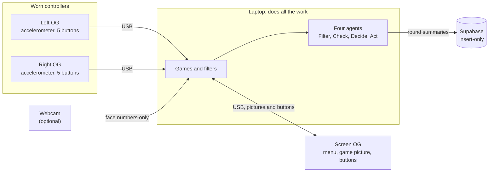

# Orca

**Rehab games you play with a pair of worn [FreeWili OG](https://freewili.com) controllers, and four agents that
filter, check, decide and act on what the sensors report, with every step shown on the device screen.**
Numbers only are kept: no video or images are ever stored.

<p align="center">
  
  
</p>
<p align="center"><sub>The OG's own screens, drawn by this project's code. The agent pages show a
<b>simulated patient</b>, not a person.</sub></p>

> **Research prototype.** Thresholds are placeholders and are **not clinically validated**. Everything in the
> demo uses a **simulated patient**. Orca makes no medical claims and is not medical advice. The games measure
> comfort and performance, not recovery; showing recovery would need a real study with consent and ethics
> approval.

## Why

At-home rehabilitation gives clinicians very little to go on. One noisy sensor cannot tell a weak hand from a
resting one, and a false alert makes people stop trusting the system. Orca turns the repetitive part into games,
records the numbers a therapist wants (range of motion, tremor, peak speed, reaction time, hit rate, pain
presses), and puts a chain of agents between the sensors and any conclusion.

## How it fits together



The OGs are deliberately simple terminals: all game logic, filtering and the agents run on the laptop, so the
display chip has nothing in it that can hang (it has no watchdog).

## What it does

**Six games**, each built around a different movement. They share the same screens, buttons, pause and pain
check-in, and the same numbers-only log.

| Game | You | Notes |
|---|---|---|
| Beat Flick | Flick each falling block the way its arrow points, in time with a built-in song | Red blocks for the left hand, blue for the right. New. |
| Rhythm Flick | Flick the wrist the way the arrow points as it lands | Tempo adapts to how you do |
| Steady Hand | Hold a cursor inside a ring, then the next ring | Measures steadiness and tremor |
| Dial | Roll a needle to a target angle and hold it | Forearm rotation |
| Brick Break | Tilt to steer a paddle and break a wall of bricks | The range you can reach is learned |
| Colour Reflex | Press the button whose colour lights up | Buttons only; reaction time |

Pause, restart and the readings pages work from the controllers' own five buttons. An optional webcam adds a
pain-expression score and a pulse, computed on the laptop.

<p align="center">
  
  
  
</p>
<p align="center"><sub>Light theme, Settings, and one agent's own page.</sub></p>

## The agents

| Agent | What it does |
|---|---|
| **Filter** | Drops readings that cannot be real (glitches, no face in view). Compares the two hands, and the face against the person's own calm baseline. |
| **Check** | Fact-checks a possible imbalance four ways: enough data, persists across windows, unusual for *this* person, other signals (face, pain) agree. Gives the evidence for each. |
| **Decide** | Turns the verdict into a difficulty recommendation with a stated rule. A finding that is not fully verified can never make the game harder, and a verified concern eases it. |
| **Act** | Saves each round and the clean readings (local queue, then Supabase) and states the recommendation. |

Verdicts: `not enough data`, `balanced`, `noted, not verified`, `watch`, `concerning (verified)`.

## Two sensors standing in for an IMU

The OG has only a 3-axis accelerometer: tilt (roll and pitch), but no heading and no rotation speed. A **BMM350
3-axis magnetometer**, wired to the OG's I2C header through an Orca module, adds the field direction:

- tilt from gravity (accelerometer) and heading from the magnetic field (magnetometer);
- a calibration that fits a sphere to a few slow turns, removing the magnetometer's large fixed offset
  (about 300 microtesla);
- a classifier that tells **turning the hand** from **sliding it sideways** by subtracting the acceleration that
  tilt alone would cause.

This is not a true 9-axis IMU. It cannot give position, it cannot see a smooth slide at steady speed, and metal
or magnets nearby disturb the heading. Try it: `python -m orca.mag_accel_tester`.

## What you need

- **Three FreeWili OGs on USB:** left hand, right hand, and the screen. Set roles with
  `python -m orca.devices --setup`, or press the gray button on each OG's screen.
- **A laptop** (Windows tested) with Python 3.12.
- **Optional:** a webcam, a Supabase project, an Agentverse account, a BMM350 on an Orca module.
- **Camera note:** the laptop camera or a phone via DroidCam work today. The ESP32-P4-EYE (FreeWili's WILEYE)
  is not used as a live camera: FreeWili's firmware takes still pictures, not video
  (see `notebook/camera-options.md`).

## Setup

```powershell
python -m venv .venv
.venv\Scripts\Activate.ps1
python -m pip install pyserial numpy pillow uagents mediapipe opencv-python pytest
cd orca\host
copy .env.example .env      # then fill in your own values (never commit .env)
```

Settings live in `orca/host/.env` (see `.env.example`), named `ORCA_*`: `ORCA_PARTICIPANT`, `ORCA_SEED`
(gives your agents their identities), `ORCA_WINDOW_S`, `ORCA_SAMPLE_S`, `SUPABASE_URL` and `SUPABASE_KEY` (an
insert-only key). Create the Supabase tables with `orca/host/supabase_schema.sql`. `.env` is git-ignored: keep
keys out of code, chats and screenshots.

### OG firmware

From the repository root (not `orca/host`):

```powershell
python tools\fw.py build orca_main
python tools\fw.py flash orca_main
```

`fw flash` does not build, so build first. Flash **one OG at a time**, with only that one plugged in, and read
[`AGENTS.md`](../AGENTS.md) first: never `fw flash` a display application by UF2. In PowerShell use
`python tools\fw.py ...`: a bare `fw` is the built-in `Format-Wide`.

## Run it

From `orca/host`, with the venv active:

```powershell
python -m orca.devices --setup                        # once: which OG is screen, left, right
python -m orca.og_shell                               # the menu and games, mirrored to the screen OG
python -m orca.beat_flick --devices devices.json      # one game on its own, two controllers
python -m orca.live_face --camera 0 --show            # check the camera sees you (q quits)
```

To start the whole demo in one go (agents and the OG shell, as the simulated participant):
`powershell -ExecutionPolicy Bypass -File .\start_demo.ps1`, with `-Simulated` to also play the simulated
patient, or `-Agentverse` for the four Agentverse agents.

Add `--face` (or `--face 1` for a second camera) to a game for the face numbers, and `--no-sound` to play Beat
Flick without the song. Only one program can open a camera or an OG's port at a time.

The agents:

```powershell
python -m orca.agents_main       # the four agents in one program: private, offline (default)
python -m orca.agent_stage       # the four agents as separate Agentverse agents (simulated data only)
python -m orca.demo_data         # a SIMULATED patient played through the real agents
python -m orca.agent_gateway     # one agent that answers ASI:One questions about the chain
```

`agent_stage` starts Filter, Check, Decide and Act on ports 8101 to 8104, each with its own mailbox. Connect each
in the Agentverse Inspector once (Connect, then Mailbox). Only run one of `agents_main`, `agent_stage` or the
gateway at a time per port.

## The simulated patient

`demo_data` plays seven sessions over two weeks (noted x4, watch, concerning, recovered) through the real agents,
so the verdicts shown are produced by the pipeline. It refuses to run unless the participant code starts with
`DEMO`, so it cannot be mixed into a real person's record. Anything recorded from it must say **simulated
patient**. The pictures in this README come from `docs/make_images.py`, which draws sample data the same way.

## Tests

The pure logic (filters, flick detection, maps and scoring, button maps, protocol parsing, the agents' rules) is
tested with no hardware. From `orca/host`:

```powershell
python -m pytest tests -q
```

The firmware's line-protocol parser has its own C test (`tests/test_rehab_proto.c`, run by `fw test`). Hardware
steps (flashing, the 6-second red-hold power-off, sound, cameras) are checked by hand: the cards are in
`notebook/manual-tests.md`.

## Troubleshooting

| Symptom | Likely cause and fix |
|---|---|
| The OG stays on "waiting for host" | Nothing has opened its port. Start `og_shell` or a game. |
| "could not open port" / access denied | Another program holds it (an old shell, a terminal). Close it, or unplug and replug. |
| "N OGs are plugged in: say which is which hand" | Run `python -m orca.devices --setup`, then pass `--devices devices.json`. |
| Cameras 0 and 1 are both the laptop | A laptop camera often shows twice (colour and infrared). Preview each with `live_face --show`. |
| A phone appears as camera 1 | That is DroidCam, a virtual camera. Windows does not list it as a device. |
| OG buttons do nothing | Test the OG alone: `python -m serial.tools.miniterm COMxx 115200` and look for `BTN ... down`. Then check what is attached to its header. |
| Camera board will not turn on | It has its own power switch ("I" is on) and needs its own USB-C or a battery; the OG does not power it. |
| `fw` is "not recognized" or runs `Format-Wide` | Use `python tools\fw.py ...` from the repository root. |

## Known limits

- One accelerometer per OG gives tilt only: no position, and no gyroscope.
- Thresholds in `skills.py` are placeholders, not validated.
- Heart rate from video needs clean, steady frames; compressed or uneven video can degrade it.
- Beat Flick's song and map are made in code; its audio sync and sound are untested on a Pi.
- No clinical or effectiveness claim is made anywhere in this project.

## Layout

| Path | What |
|---|---|
| `host/orca/` | Laptop-side Python: games, OG link and screen, the four agents, simulator, session log. |
| `host/tests/` | Host tests: no hardware needed. |
| `host/supabase_schema.sql` | Tables: `rounds`, `hand_readings`, `face_readings`. |
| `docs/` | `images/` for this README, and `make_images.py` that draws them. |
| `notebook/` | Design notes, rules, camera research, manual test cards, hackathon text. |
| `../apps/orca/` | OG firmware pair. The display half is a terminal driven over USB CDC. |
| `../bsp/`, `../tools/` | The FreeWili OG board-support package this builds on, and its `fw.py` task runner. |

## Credits and licence

Built on the FreeWili OG BSP in this repository (see its licence and `AGENTS.md`). Agents use the
[Fetch.ai uAgents](https://github.com/fetchai/uAgents) framework and Agentverse. Beat Flick's scoring idea is
adapted from the MIT-licensed [BeepSaber](https://github.com/NeoSpark314/BeepSaber); its song is synthesised in
code, so there are no audio licences to worry about.
