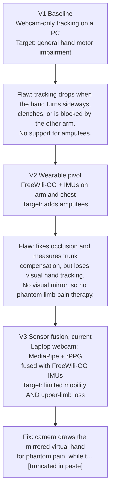
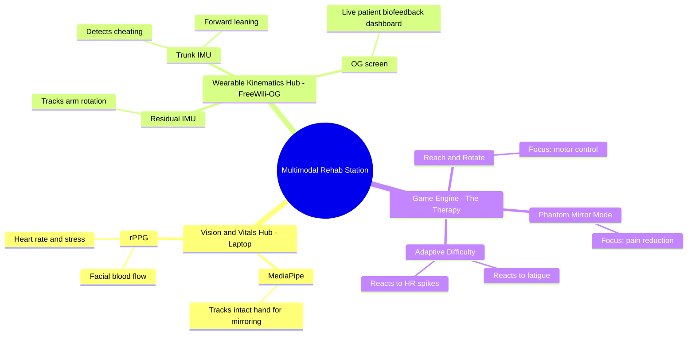
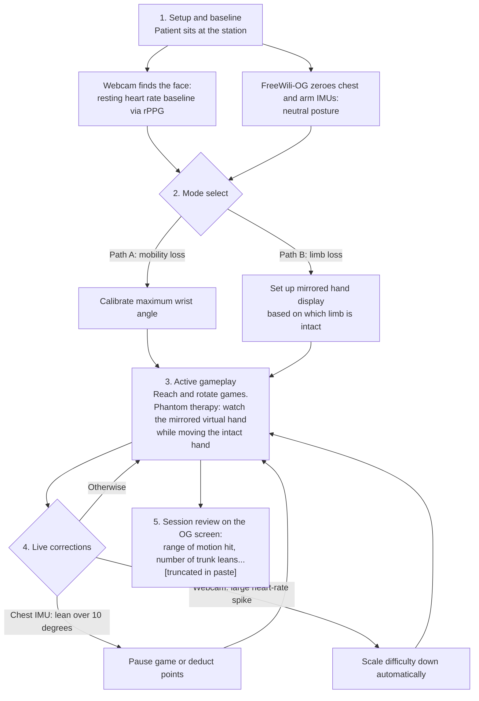
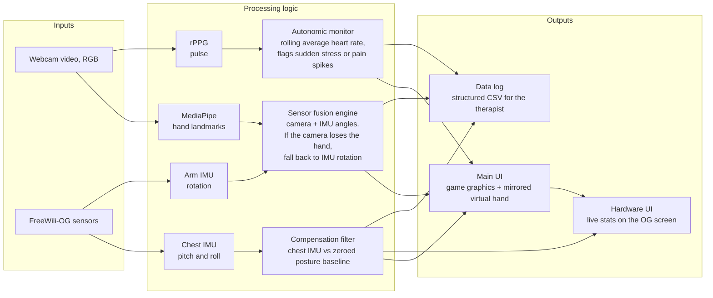
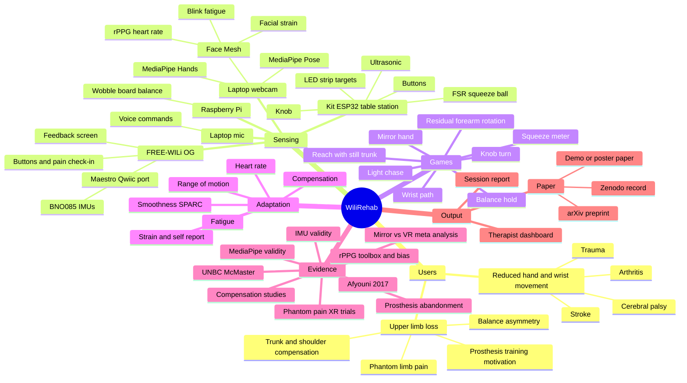
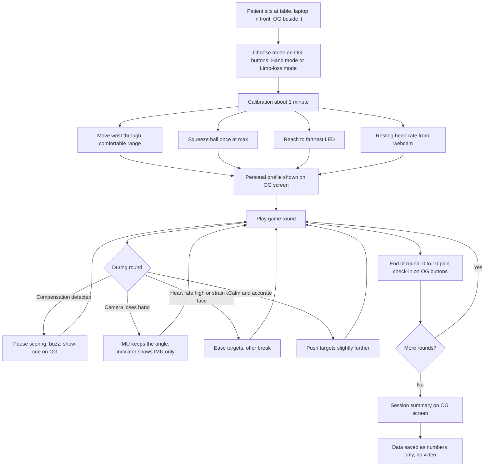
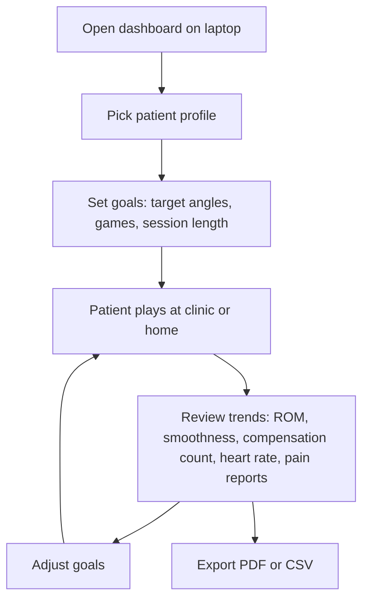
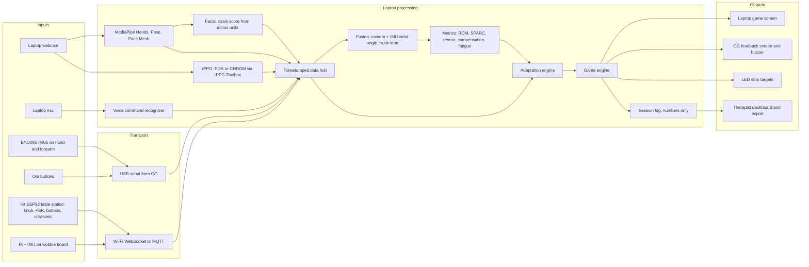

# V3 diagrams (Mermaid)

Source: the hackathon notes on design evolution, mind map, user flow and architecture. Mermaid renders on GitHub, Obsidian and VS Code's markdown preview; Notability will not render it, so redraw by hand there.

**Three of the pasted texts were cut off.** I marked each cut `[truncated in paste]` and did not guess the ending. Paste the missing text and I will fill it in.

**Conflicts with earlier pages, to settle:**
- This version uses **chest and arm IMUs**; the older hardware list says IMUs are still *to buy* and the v9 design dropped them in favour of webcam-only. V3 effectively reinstates them (Step 5 in Page 10 becomes required, not optional).
- The pages say **OLED screen**. The OG's panel is an ST7789 colour **LCD** (`bsp/display_cpu/lcd/st7789.h`). Use "OG screen" unless you have a different board.
- "Seamlessly" falls back to IMU rotation: IMU rotation alone has no absolute reference and drifts, so the fallback holds for seconds to minutes, not indefinitely. Worth stating in the paper.
- The ">10 degrees" lean threshold and the heart-rate "massive spike" are not yet defined numbers. They need values from evaluation testing.

---

## Design evolution (V1 to V3)

---

## System mind map

---

## User flow

---

## Architecture flow, inputs to outputs

The edge `UI --> HW` and the exact wiring of what feeds the OG screen are my reading of "pushes live stats back"; check them against your intent.

---

# Earlier version (v9, webcam-only), kept for history

Diagrams carried over from the old notebook pages before they were removed. They describe the superseded webcam-only design; the V3 diagrams above replace them.

## v9 mind map

## v9 patient session

## v9 therapist flow

## v9 architecture flow

