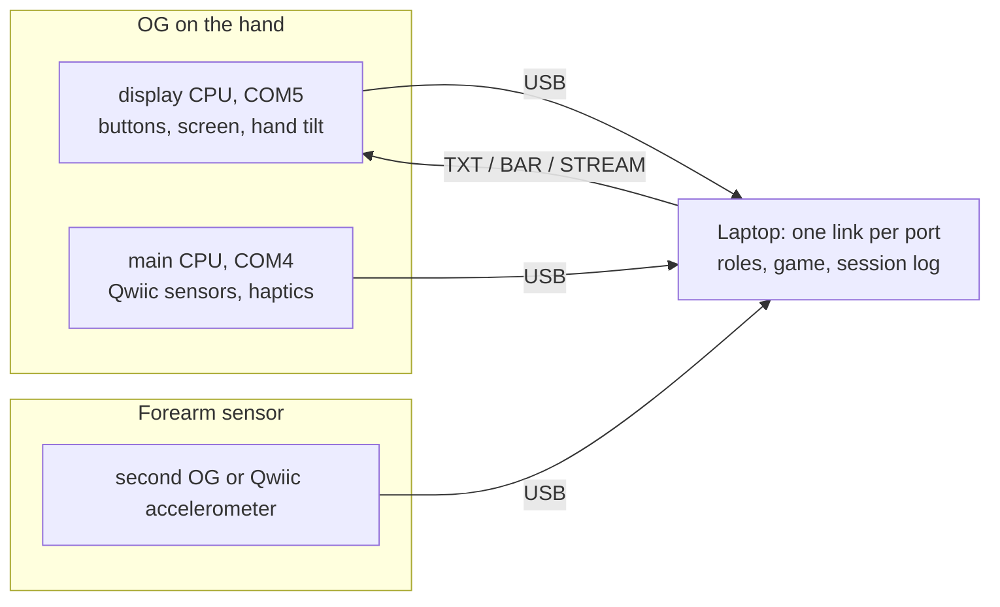

# Games, hardware and how it all connects

Status words used here: **built** = code written, not yet run by you; **verified** = confirmed from this repo or your photos; **unverified** = claimed by something I could not check.

## 1. Read this first: the pasted research text is unchecked
The text pasted in (games, quotes, percentages, sensor history) came from outside this repo. I have not opened any of those papers, so none of its numbers or quotes are verified. That includes the repetition counts, accuracy figures, F1 scores, participant counts and every quoted phrase. Under R4, nothing goes into the paper until someone has read the PDF and copied the number from it.

Two specific cautions:
- **Sensor history.** The pasted paragraph says every design change was driven by a research finding. The real history in this notebook is different: the move from camera to wearables was driven by the camera losing the hand (occlusion). Write the real reason, and add the literature as support where it truly supports it. A rationale written after the fact is the kind of thing reviewers catch.
- **Scope.** The design now assumes one person with a single upper-limb loss, with the OG buttons as the input. Grip-strength and finger-independence games (squeeze, finger piano) target weak-grip and stroke users. Decide if they stay in scope.

## 2. The games

| # | Game | Needs | Can build now with the OG? | Status |
|---|---|---|---|---|
| 1 | Catch (first game) | OG tilt or buttons | yes | built, tilt steering seen working |
| 2 | **Rhythm Flick** (arrows on a beat, flick the wrist; L/R lanes with two OGs) | OG accelerometer | yes | **built**, not yet run |
| 3 | Wrist path (follow a moving target) | hand tilt; a true wrist angle needs a forearm sensor | tilt version yes | not built |
| 4 | **Mirror hand** (driver OG turns a drawn hand, mirror on the other side) | one OG, or two | yes | **built**, not yet run |
| 5 | **Dial** (roll the OG to match a target) | OG roll, forearm flat | yes | **built**, not yet run |
| 9 | **Brick Break** (paddle and ball) | OG pitch (wrist up/down), or roll | yes | **built**, not yet run |
| 10 | **Steady Hand** (hold a cursor in a ring) | OG roll and pitch together | yes | **built**, not yet run |
| 11 | **Colour Reflex** (press the colour that lights) | OG buttons only | yes | **built**, not yet run |
| 6 | Squeeze meter | force sensor (FSR) + ADC | needs parts | not built |
| 7 | Finger piano | 5 force sensors | needs parts | not built |
| 8 | Still-trunk reach | a second sensor on the chest, or camera pose | needs a part | not built |

My suggested order: 2 (done), 4 (fits the limb-loss scope best), 3, then whichever needs the hardware you decide to add.

**Rhythm Flick, how it works.** Arrows fall to a line on the beat. A flick of the OG in the arrow's direction as it lands is a hit (window +-0.35 s). Left/right by default, `--dirs all` adds up/down. 8 hits in a row raise the tempo by 5 BPM, 3 misses in a row lower it by 5 (30 to 90). "Pain now" cuts 10 BPM. Yellow and blue (and keys 2, 4, u, d) act as flicks so you can test without the OG.
**Its limits.** The OG has no gyroscope, so flick speed is the change of tilt angle over time. That is cruder than a gyro and gets distorted while the hand accelerates, so the speed threshold (`--flick-dps`) is a setting to tune. There is no haptic buzz yet; feedback is on screen.
**Naming.** Do not call it Beat Saber or copy its look; Rhythm Flick is the working name.

## What each game actually uses (so the variety is real)

| Game | Input from the OG | Movement or measure |
|---|---|---|
| Catch | roll (default) | forearm rotation, one axis |
| Brick Break | **pitch** (default) | wrist flexion/extension, one axis, the other one |
| Rhythm Flick | fast changes of roll **and** pitch | quick flicks in four directions |
| Steady Hand | roll **and** pitch together | two-axis steadiness; tremor |
| Colour Reflex | five buttons, no tilt | reaction time; button hold time |
| Dial | roll, wide range | forearm rotation to a target |
| Mirror Hand | roll, drawn as a hand | mirror therapy view; two-hand comparison |

Still limited by one accelerometer per hand: tilt only, no yaw, no true position. Left/right and up/down **position** of the hand is not measured by any of these.

**Measures added** (indirect, from data the games already collect): reaction time, button hold time, repetitions, a fatigue trend (success rate or reaction time against session time), tremor strength in the 4-12 Hz band, and per-hand roll and pitch range. Each needs its own citation; see evidence.md.

## Current plan: two OGs, one per hand (supersedes the ESP32 and add-on ideas in sections 3 and 4)

Hardware now: **two FREE-WILi OGs, one strapped to each hand.** No ESP32, no breadboard, no chest sensor, no external sensors. The Maestro is optional and only for later. No main-CPU firmware is needed or written.

| Feature | Earlier plan | Two-OG plan |
|---|---|---|
| Sensor hub | ESP32 on a breadboard | none: each OG connects by USB |
| Hand sensing | 1 OG + up to 3 accelerometers | 1 OG per hand (built-in accelerometer) |
| Forearm reference | accelerometer on the forearm | forearm resting on a towel roll (a posture method) |
| Trunk | chest accelerometer | webcam head movement, later |
| Rotation (dial) | potentiometer | OG roll angle |
| Finger game | 5 kit buttons | the OG's own 5 buttons |
| Grip | force sensor | dropped (state it as a limitation) |
| Left/right measures | none | mirror game and symmetry table |
| Wiring | breadboard and jumpers | none |

**What is built (all unrun until you test it):**
- **Roles by USB serial number.** `devices.json` maps `left_hand` and `right_hand` to the OG's USB serial; `python -m wilirehab.devices --setup` fills it by asking you to press a button on each OG. Every data row carries its hand.
- **Rhythm Flick with two hands.** Arrows are marked L or R and fall in that hand's lane; a flick counts only from the matching hand's OG.
- **Mirror hand.** The driver OG's tilt turns a drawn hand; the other side shows the mirror image. If the other hand has an OG, its real tilt is drawn as a dashed ghost and the match is logged.
- **Dial.** Roll the OG to match a target angle and hold it.
- **Symmetry table** on every summary when both OGs are present: range, peak speed and hit rate per hand, with the weaker/stronger ratio.

**Limits to state in the paper:**
- One accelerometer per hand gives tilt against gravity, with no yaw and no gyroscope. Peak speed is the change of that tilt over time, so it is a rough measure for comparing a person's own two sides, not a clinical value.
- Wrist angle relative to the forearm is **not** measured. The forearm is held still by posture (a towel roll), which is an assumption, not a measurement.
- Hit timing is judged on the laptop clock when each flick arrives, so USB adds a few milliseconds of jitter.
- The Cochrane 2018 mirror-therapy reference in the design note, and every other citation, are **unverified** until the PDF is opened (R4).

**Scope note.** The design text has now described three user groups in turn: one upper-limb loss with buttons only, then stroke-style weak/strong hands, now bilateral training with two OGs. The mirror game works for either. Decide which group the paper is about before writing the introduction.

## 3. Hardware (the earlier plan, kept for history)

### Already on the OG (verified from this repo)
- 5 buttons, 7 RGB LEDs, colour LCD, speaker and microphone drivers, IR, and the accelerometer on the display CPU.
- The main CPU has its own USB serial port (your COM4), separate from the display CPU's (COM5). That is where anything on the I/O header would report.
- The 20-pin header exposes I2C0 (pins 8 and 10, SCL and SDA), 3.3 V (pin 6), grounds (pins 19 and 20), and a spare input on pin 14 (GPIO26). On the RP2040 chip GPIO26 is an analogue-capable pin, so a single force sensor could go there. Whether the board routes it as analogue is **unverified**.

### What the Maestro photo shows
A Qwiic connector, SWD and UART debug switches, and a labelled GPIO breakout (including SDA0/SCL0 on IO16/IO17). I cannot see an **SD card slot** in the photo. The claim that the Maestro logs to SD is **unverified**: check the board before planning around it.

### Additions, in the order I would add them
1. **A second accelerometer for the forearm** (a cheap Qwiic 3-axis board, or a second OG). Then wrist angle = hand tilt minus forearm tilt, which fixes the main limit of one sensor. It needs only a tiny register-level driver, the same kind of work as the existing one.
2. **Haptic driver** (Qwiic DRV2605L plus a small vibration motor): a buzz on hits and cues. Easy to drive (a few registers) but needs main-CPU firmware, which does not exist yet.
3. **BNO085 IMU:** gives a gyroscope and fused orientation, but speaks a more complex protocol and needs a real driver. Only worth it if the two-accelerometer setup proves too crude.
4. **Force sensor (FSR) + ADC** for squeeze, and **potentiometer** for the dial, only if those games stay in scope. The ESP32 in your kit has ADCs for the 5-finger pad.
- All of the main-CPU items need **new main-CPU firmware**: it must read the I2C sensors, kick the watchdog every loop, and print lines to COM4. None of that is written.

## 4. How everything connects

The laptop is the hub. Every board is a USB serial device; the laptop reads each and gives it a role.

- **One link per port.** The code already has one `OgLink` per serial port; a hub would hold several and tag each event with its role (hand, forearm).
- **Roles by serial number, not COM number.** COM numbers change. Your two CPUs report fixed USB serial numbers (display `...0A35`, main `...5A37`). A small config file would map serial number to role, and a second board would add two more serials.
- **Time.** Each board stamps samples with its own clock. The laptop stamps arrival time and estimates each board's offset with a round trip; a few milliseconds of jitter is expected and should go in the limitations.
- **Two boards on one laptop:** four serial ports in total. Put them on a powered hub if the laptop's ports are short.
- I do not connect to any hardware myself. Every hardware step is a command you run and report back (R1).

## Changelog
| Date | Change |
|---|---|
| 2026-10-03 | Page created. Rhythm Flick built; research text flagged as unchecked. |
